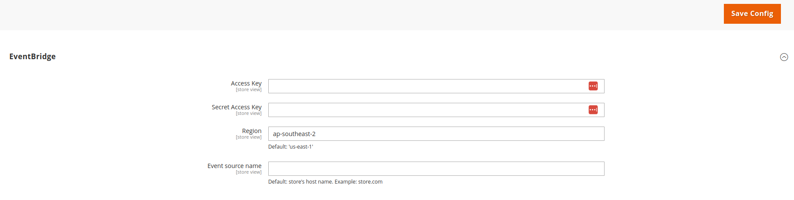

# MageOS Async Events AWS

AWS event sinks for [mageos-async-events](https://github.com/mage-os/mageos-async-events)

## Installation

```sh
composer require mage-os/mageos-async-events-aws
```

## AWS event sinks

### Amazon EventBridge

**Configure AWS Credentials**

An IAM role with the `events:PutEvents` action is required so that the notifier can relay events into Amazon
EventBridge.

Under `Stores -> Services -> Async Events AWS` set the `Access Key` and the `Secret Access Key` and the `Region`. You
can also choose to configure the source of the event.



**Create an EventBridge Subscription**

The following is an example to create an EventBridge subscription for the `example.event`

```shell
curl --location --request POST 'https://test.mageos.dev/rest/V1/async_event' \
--header 'Authorization: Bearer TOKEN' \
--header 'Content-Type: application/json' \
--data-raw '{
    "asyncEvent": {
        "event_name": "example.event",
        "recipient_url": "Amazon Event Bridge ARN",
        "verification_token": "supersecret",
        "metadata": "eventbridge"
    }
}'
```

### Amazon Simple Queue Service

**Configure AWS Credentials**

An IAM role with the `sqs:SendMessage` action is required so that the notifier can relay events into Amazon
SQS.

Under `Stores -> Services -> Async Events AWS` set the `Access Key` and the `Secret Access Key` and the `Region`.

> [!NOTE]
> The maximum message size for SQS is 262,144 bytes (256 KiB)

**Create an SQS Subscription**

```shell
curl --location --request POST 'https://test.mageos.dev/rest/V1/async_event' \
--header 'Authorization: Bearer TOKEN' \
--header 'Content-Type: application/json' \
--data-raw '{
    "asyncEvent": {
        "event_name": "example.event",
        "recipient_url": "Amazon SQS queue URL",
        "verification_token": "supersecret",
        "metadata": "sqs"
    }
}'
```

## Contributing

This is a repository for distribution only.
Contributions are welcome on the development
repository [mageos-async-events-sinks](https://github.com/mage-os/mageos-async-events-sinks)
